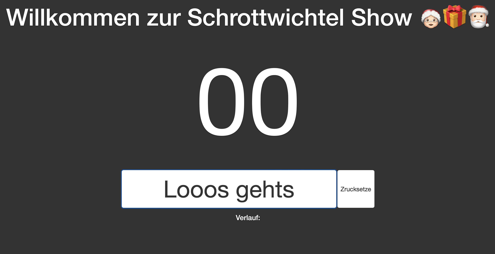

# 🎄 Christmas Party Bingo

[](https://akeschmidi.github.io/partybingo-gh-pages/) 
[](LICENSE)
[](https://getbootstrap.com/)
[](https://jquery.com/)

> A festive Christmas-themed bingo game perfect for holiday parties, "Schrottwichteln" events, or cozy bingo evenings with friends and family.

## ✨ Features

- 🎲 Random number generator from 1-90 with audio effects
- 🔄 Dynamic button text that changes after first number is drawn
- 🔍 Number verification function to check if a number has been drawn
- ✅ Visual highlighting of verified numbers
- 🎅 Beautiful Christmas-themed UI with animations and effects
- 📱 Fully responsive design for all devices
- 💾 Game state saved in browser localStorage

## 🔴 Live Demo

**[Try the Christmas Bingo Live Demo Here](https://akeschmidi.github.io/partybingo-gh-pages/)**

## 📸 Screenshot



## 🚀 Quick Start

### Option 1: Clone the Repository

```bash
# Clone with GitHub CLI
git clone https://github.com/akeschmidi/partybingo-gh-pages.git

# Navigate to project directory
cd partybingo-gh-pages

# Open in your browser
open index.html
```

### Option 2: Download as ZIP

1. Click the green "Code" button at the top of the [GitHub repository](https://github.com/akeschmidi/partybingo-gh-pages)
2. Select "Download ZIP"
3. Extract the ZIP file
4. Open `index.html` in your web browser

## 🎮 How to Play

1. Click the "Start" button to begin drawing numbers
2. Click "Stop" to draw a random number
3. The button will change to "Nächste Zahl" (Next Number) after the first draw
4. Use the verification form to check if a specific number has been drawn
5. Click on highlighted numbers to remove the highlight
6. Click "Reset" to start a new game

## 🛠️ Technologies

- HTML5
- CSS3 with advanced animations
- JavaScript (ES6+)
- Bootstrap 5.3
- jQuery 3.6.0
- Font Awesome 6.4.0
- Google Fonts (Montserrat)

## 📄 License

This project is licensed under the MIT License - see the [LICENSE](LICENSE) file for details.

## 👥 Contributing

Contributions, issues, and feature requests are welcome! Feel free to check the [issues page](https://github.com/akeschmidi/partybingo-gh-pages/issues).

---

Made with ❤️ for Christmas bingo enthusiasts everywhere
